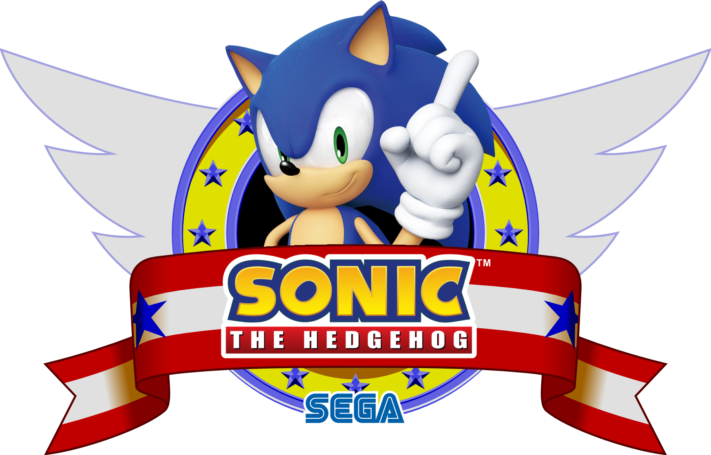

## Overview

Celebrate Sonic's 40th anniversary with Sonic '31, a groundbreaking fusion of classic high-speed platforming and modern open-world adventure mechanics. The game redefines Green Hill Zone as a vast, evolving environment where every twist and turn holds a new challenge or hidden secret. Players will experience thrilling gameplay, dynamic combat, character-driven storytelling, and environmental puzzles, all while exploring a seamless day-night cycle and an interconnected world filled with ancient mysteries and technological threats.

# 1. Expansions and Explorations

## Expansive Zones:

Green Hill Zone serves as a central hub, branching into a diverse array of biomes:

Emerald Ravines: Vibrant forests filled with cascading waterfalls and treacherous rock formations.

Mystic Caverns: Underground mazes with glowing crystals and ancient machinery.

Skybound Ruins: Floating islands that test aerial navigation skills.

Chaos Wastelands: A desolate area where reality collapses, filled with time-shifting obstacles.

## Exploration Features:

Seamless Zone Transitions: Traverse vast landscapes without load times, maintaining the thrill of uninterrupted speed.

Traversal Abilities: Utilize each character’s unique movement abilities to unlock shortcuts and hidden areas.

Collectibles and Lore Artifacts: Discover Chaos Emeralds, Ancient Glyphs, and hidden recordings that unveil the history of Green Hill.

# 2. Environmental and Chaos Puzzles

## Dynamic Day-Night Cycle and Environmental Shifts:

Daytime: Bright, energetic landscapes filled with high-speed traversal challenges and large enemy groups.

Nighttime: Mysterious atmospheres with stealth-focused gameplay, rare enemy encounters, and hidden paths.

Weather Effects: Dynamic weather impacts gameplay, such as rain making surfaces slippery or strong winds affecting aerial maneuvers.

## Chaos Puzzles and Mechanics:

Solve puzzles requiring careful timing, elemental manipulation, and multi-character cooperation.

Chaos Anomaly Zones introduce time distortion mechanics, where players can manipulate the environment by rewinding or accelerating time.

# 3. Character Customization & Progression

## Upgrades and Customizations:

Skill Trees: Tailor each character’s abilities for combat, traversal, and exploration.

Chaos Shard Upgrades: Unlock new powers by collecting and purifying corrupted Chaos Shards.

Cosmetic Customization: Anniversary-themed outfits and unlockable skins that celebrates Sonic’s history.

## Boss Encounters & Chaos Guardians:

Each biome culminates in a challenging boss fight requiring skill, strategy, and Teamwork.

Eggman’s Chaos Mechs: Gigantic machines powered by Chaos energy, featuring multiple phases and weak points.

Zone Guardians: Ancient protectors corrupted by Chaos energy, each with unique attack patterns and puzzle-like vulnerabilities.

The Chaos Manifestation: A final battle that challenges players to restore reality while facing off against Eggman and a Chaos-fueled nightmare.

# 4. Narrative Themes & Character Development

Sonic: A tale of responsibility as Sonic grapples with the weight of saving reality while remaining true to his free-spirited nature.

Tails: Explores his growth into a confident and genius inventor.

Knuckles: A journey of rediscovery as he reconnects with his heritage as the guardian of ancient Chaos relics.

Amy: Her evolution from a love-struck follower to a tactician.

Rouge: Balances her treasure-seeking tendencies with newfound loyalty to the team.

Cream: Learns the importance of courage and self-reliance, stepping up in critical moments.

# 5. Enhanced High-Speed Platforming Mechanics

Momentum-Based Traversal: Maintain high speed to access secret routes or reach distant locations.

Dynamic Terrain Interaction: The environment reacts to your speed, creating collapsible paths, destructible barriers, and shifting platforms.

# 6. Advanced Combat System

Combat evolves beyond simple spin attacks, featuring complex mechanics that allow each character to shine in battle.

## Sonic:

Dash Burst: Dash between multiple enemies in a flash, chaining attacks together.

Shift Through: Briefly pass through enemy attacks during chaos anomalies.

## Tails:

Drone Storm: Deploy multiple drones for simultaneous attacks or puzzle-solving.

EMP Shockwave: Disable enemy shields and machinery.

## Knuckles:

Dash Slam: Dash and create fissures that damage enemies and reveal hidden paths.

Power Guard: Absorb damage and release a devastating counterattack.

## Amy:

Spin Hammer Attack: Hammer spin that deflects projectiles and clears enemies.

Invisibility: Turns invisible to bypass enemies or sneak into restricted areas.

## Rouge:

Pulse Barrier: Reflects energy-based attacks back at enemies.

Stun Mine: Temporarily paralyzes nearby enemies.

## Cream & Cheese:

Healing Touch: Restores party health during battles with touch.

Blitz: Cream coordinates powerful attacks with Cheese for devastating combos.

# 7. Cooperative Gameplay & Character Switching

Seamless Character Integration: Players can switch between characters to utilize their unique skills during missions and exploration. Each non-selected character will be controlled by AI.

Drop-in/Drop-out Co-op Mode: Local or online multiplayer allows friends to join the adventure.

## Legacy Content:

Remastered Zones: Revisit iconic levels from past Sonic games, updated with modern graphics and mechanics.

Music and Sound: Classic tracks remixed alongside brand-new compositions. Players can switch between modern and retro soundtracks.

Unlockable Collectibles: Discover artwork, music, and behind-the-scenes content celebrating Sonic’s 35-year journey.

## Multiplayer Challenges:

Speed Races: Compete in high-speed races with friends.

Battle Arenas: Test combat skills against waves of enemies or other players.

Puzzle Trials: Cooperative puzzle-solving modes that challenge teamwork and creativity.

# Episode I: Green Hill Zone

## Prologue:

Green Hill Zone, once a peaceful and vibrant landscape, is shaken by a mysterious and powerful energy pulse originating from deep within the earth. Strange crystal formations erupt from the ground, distorting time and space. Rivers flow backward, land fragments hover in midair, and the serene sky flickers between day and night. The animals of the region are in chaos, and portals to unexplored dimensions appear without warning.

Tails detects an unusual signal emanating from the depths of Green Hill and calls Sonic for help. Simultaneously, Dr. Eggman intercepts the same signal and identifies it as Chaos technology far more powerful than the Chaos Emeralds. Driven by ambition, he devises a plan to harness this energy to create a utopia under his control, Eggmanland Prime. He constructs a colossal fortress deep underground to extract and weaponize the ancient energy source, fracturing the very fabric of reality in the process.

Sonic, Tails, Knuckles, and Amy reunite to investigate the anomalies, soon joined by Rouge the Bat, who seeks the legendary Chaos Relics hidden within Green Hill for her own reasons. Cream and Cheese also join the team after witnessing strange distortions near their home. Despite their differing motivations, the group forms an uneasy alliance, determined to stop Eggman’s plan and restore balance to their world.

## Act 1: Chaos Awakens

The group sets out to explore the sprawling new Green Hill landscape, now fragmented into unstable zones filled with chaos anomalies. Each character brings their unique abilities to the mission: Sonic speeds through corrupted loops, Tails uses his gadgets to analyze chaotic disruptions, Knuckles punches through unstable rock barriers, and Rouge scouts ahead for hidden pathways.

They encounter Eggman’s advanced robot army, powered by corrupted Chaos energy, and realize the gravity of the situation when they face the Titan Mech, a massive robot guarding Eggman’s underground extraction facility. Despite the team’s best efforts, Eggman manages to activate the Chaos Core, triggering a massive surge that spreads chaos energy across multiple regions. Reality itself begins to collapse, creating dangerous rifts where time and space spiral out of control.

Sonic and his friends barely escape the explosion, regrouping to plan their next move. Tails theorizes that stabilizing the chaos anomalies requires locating and purifying the Chaos Shards, fragments of ancient technology scattered throughout the land. However, these shards are fiercely protected by corrupted Zone Guardians, powerful remnants of ancient civilizations.

## Act 2: The Guardians' Challenge

The team embarks on a perilous journey through five distinct biomes:

### 1. Emerald Ravines: A dense, forested area where the environment shifts between spring and autumn due to chaos distortions.

### Guardian Battle: Terra Beast, a stone giant corrupted by chaos energy, guards the first shard.

### 2. Mystic Caverns: A labyrinthine underground zone with glowing crystal formations that pulse with chaotic energy.

### Guardian Battle: Crystal Wyrm, a serpentine creature that manipulates light and shadow, tests the team's puzzle-solving skills.

### 3. Skybound Ruins: Floating islands suspended by ancient technology, constantly buffeted by high winds.

### Guardian Battle: Tempest Hawk, a colossal bird-like machine that controls the winds.

### 4. Chaos Wastelands: A harsh desert-like biome where time flows unpredictably, causing sandstorms and mirages.

### Guardian Battle: Phantom Stalker, a shapeshifting entity that exploits temporal anomalies.

### 5. The Void Frontier: The heart of the chaos corruption, where reality bends and warps.

### Guardian Battle: Eclipse Titan, a towering machine that serves as the ultimate test of the team's strength and unity.

As they defeat each Guardian and purify the Chaos Shards, the team learns more about the ancient civilization that once harnessed this energy to maintain harmony. However, arrogance and greed led to their downfall, a fate Sonic and his friends are determined to prevent from repeating.

## Act 3: The Final Conflict

With the Chaos Shards purified and the anomalies stabilized, the team prepares for a final assault on Eggman’s fortress. However, Eggman reveals a devastating twist: using a fragment of chaos energy he had secretly corrupted, he has constructed the Chaos Amplifier, a device capable of warping the very fabric of reality to his will. With it, Eggman transforms himself into Chaos Emperor Eggman, a form that merges machine and chaos energy into a nearly invincible being.

The team must confront Eggman in an epic multi-phase battle:

### 1. Phase One: The team dismantles Eggman’s automated defenses and disables the chaos energy generators powering his fortress.

### 2. Phase Two: Eggman engages the group directly using chaos-powered mechs and traps.

### 3. Phase Three: The final showdown takes place within a collapsing chaos dimension, where Sonic taps into the purified Chaos energy to achieve a new form, Super Sonic Prime, while the rest of the team uses their enhanced abilities to assist.

Through teamwork and determination, they defeat Eggman, who escapes as his fortress crumbles. The purified Chaos Core stabilizes the world, sealing away the chaos anomalies and restoring Green Hill Zone to its natural beauty.

## Epilogue:

As peace returns to the land, the group reflects on their journey. Tails resolves to continue studying Chaos energy to better understand its potential. Knuckles vows to protect the ancient relics and their secrets. Rouge, having found an unexpected sense of camaraderie, agrees to keep her treasure-hunting in check—at least for now. Cream matures, learning the importance of courage, and Sonic, ever the hero, looks forward to new adventures with his friends.

A mysterious post-credits scene teases the return of a forgotten villain awakened by the chaos disruptions, hinting at future challenges for Sonic and his allies.

# Episode II: The Chaos Within Shadow

## Shadow's Story Arc Introduction:

As chaos energy spreads uncontrollably across Sonic's world, Shadow receives a psychic summons from an unknown entity within the corrupted Void Frontier. Haunted by visions of destruction and cryptic warnings, Shadow senses a connection between the ancient Chaos energy and his own origins as the Ultimate Lifeform. Determined to uncover the truth and control the chaotic forces threatening reality, Shadow embarks on a parallel journey separate from Sonic's team.

## Shadow’s Mission:

Shadow must confront both external threats and his inner turmoil over his purpose as a creation of science intertwined with Chaos energy. His quest involves uncovering the dark secrets of the ancient civilization that once wielded Chaos technology and learning why remnants of their influence still linger in his psyche.

## Shadow’s Gameplay Features:

### 1. Chaos Abilities & Combat Enhancements

Shadow’s abilities offer a mix of raw power, precision, and chaos manipulation, distinct from Sonic’s speed-focused gameplay:

Chaos Spear: A ranged energy attack that can disable enemies or activate distant switches.

Chaos Blast: An explosive AOE attack fueled by chaos energy, devastating nearby foes.

Chaos Control: Manipulates time and space to freeze enemies or teleport short distances.

Enhanced Combat: Shadow’s melee attacks are faster and more aggressive, including combos and counters against enemy assaults.

### 2. Advanced Traversal Mechanics

Hover Skates: Allow Shadow to glide across surfaces with greater precision during platforming segments.

Chaos Rift Traversal: Shadow can exploit dimensional rifts to bypass obstacles or uncover hidden paths.

### 3. Shadow’s Chaos Trials

Shadow faces a series of Chaos Trials, spiritual challenges designed by the ancient civilization to test one’s mastery over chaos energy:

#### 1. Trial of Balance: Master controlling chaos energy without succumbing to corruption.

#### 2. Trial of Truth: Confront Shadow's inner doubts and fragmented memories of Maria Robotnik.

#### 3. Trial of Unity: A test requiring Shadow to work with unexpected allies to stabilize chaotic dimensions.

## Act 1: The Summons

Shadow arrives at the Chaos Nexus, a mysterious temple unearthed by the chaos pulse. There, he encounters holographic recordings of the ancient civilization warning of the dangers of chaos energy manipulation. They reveal that an ancient Chaos Avatar created to protect the balance was corrupted and now seeks to dominate all dimensions. Shadow's connection to this entity becomes evident, hinting at a shared origin tied to the experimentation that led to his creation.

## Act 2: Confronting the Chaos Avatar

Shadow tracks chaos disturbances to different corrupted biomes, facing powerful Chaos Wraiths—fragments of the Chaos Avatar bent on destabilizing the world. As Shadow purifies these entities, he gains deeper insight into his connection to chaos energy and strengthens his control over it. Along the way, Shadow battles Eggman’s advanced Eclipse Division, a subset of Eggman’s army designed specifically to capture and weaponize chaos anomalies.

## Act 3: The Final Showdown

Despite his lone-wolf tendencies, Shadow realizes that the escalating chaos corruption requires cooperation. He reluctantly joins forces with Sonic and the rest of the team during their assault on Eggman’s fortress. During the final confrontation, Shadow faces the fully resurrected Chaos Avatar Chaos Revenant in a climactic battle that tests his mastery of Chaos energy.

### Shadow’s Redemption Arc: Through his journey, Shadow reconciles with his purpose, realizing that being a creation of chaos does not bind him to darkness but offers him a unique ability to protect the world.

### Gameplay Expansions Featuring Shadow:

#### 1. Chaos Avatar Showdown:

Shadow's unique final boss fight takes place in a dimension where time, gravity, and space constantly shift.

##### Phase One: Battle against the Chaos Revenant’s chaotic wraith forms while avoiding dimensional collapses.

##### Phase Two: Shadow must use Chaos Control to manipulate time, freezing enemy movements while dodging rift explosions.

##### Phase Three: Shadow transforms into Super Shadow, harnessing purified Chaos energy to deliver the final blow and seal the Chaos Revenant within the Nexus Core.

#### 2. Shadow’s Exploration Zones:

Exclusive levels designed for Shadow’s gameplay mechanics, focusing on high-speed traversal combined with chaos energy manipulation:

Rifted Highlands: Terrain where time distortions create shifting platforms and obstacles.

Obsidian Peaks: A volcanic region infused with corrupted chaos energy.

Dimensional Rift Zones: A surreal, ever-changing landscape requiring precise use of Chaos Control.

#### 3. Multiplayer & Bonus Missions:

Shadow becomes a fully playable character in story and multiplayer modes, including exclusive chaos-themed challenge maps.

Cooperative Chaos Trials: Players can join forces as Sonic and Shadow to tackle difficult challenges requiring speed and chaos mastery.

## Epilogue and Shadow’s Legacy:

With the world stabilized and chaos corruption sealed, Shadow resolves to continue protecting reality from unseen threats. He chooses to remain at the Chaos Nexus, guarding the balance between dimensions. The game hints at Shadow’s ongoing journey as a guardian, laying the groundwork for future expansions or standalone adventures.

A post-credit scene reveals a mysterious figure observing Shadow from afar, teasing new threats emerging from the echoes of chaos energy manipulation.
